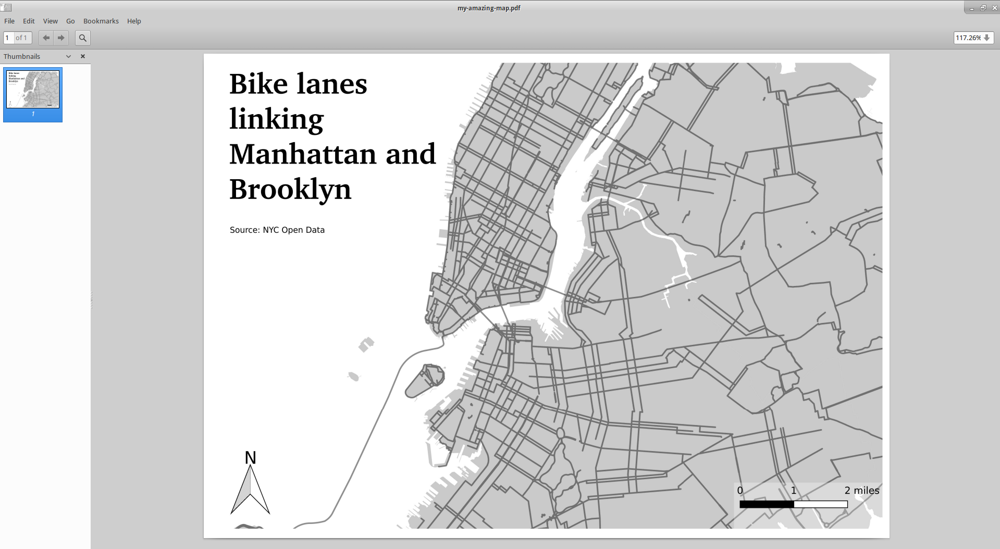

<!-- bike exercise  -->

---

#Getting More Analytical - Geoprocessing
--

##**Buffering** - Allows you to expand the area around your feature
--

##**Clipping** - Allows you to cut away what you don't need

---

##We'll do some geoprocessing on bike accidents, as they relate to bike lanes.   To review a bit:
--

+ First, bring in the bike lanes shapefile
--

+ Then, bring in the bike accidents .csv
--

+ Convert this to a shapefile

---

class:center, middle
##We want to capture bike accidents that happened outisde of bike lanes.   
--

##How might we go about this?

---

##First, we'll buffer
--

+ Open buffer tool:
--

--

--

+ What is the input file?
--

+ Distance
--

+ Click OK - results?
--

+ Save this as a new layer

---

class:center, middle
##Now we want to get rid of all the accidents that don't intersect with the bike lanes. 
--

##How might we do this?

---

#Now, we'll clip
--

+ Open clipping tool
--

+ What is the input file and what is the processing file?
--

+ Click OK - results?
--

+ Save this as a new layer

---

#Your Turn
--

##Working in teams, create a scenario with this bike data, and do two things:
--

+ Some type of geoprocessing, using clipping or buffering or both
--

+ Don't forget about querying / filtering!
--

+ Then you'll add some style to your results
--

+ Finally, create an export using the Print Composer, to share with the class.
